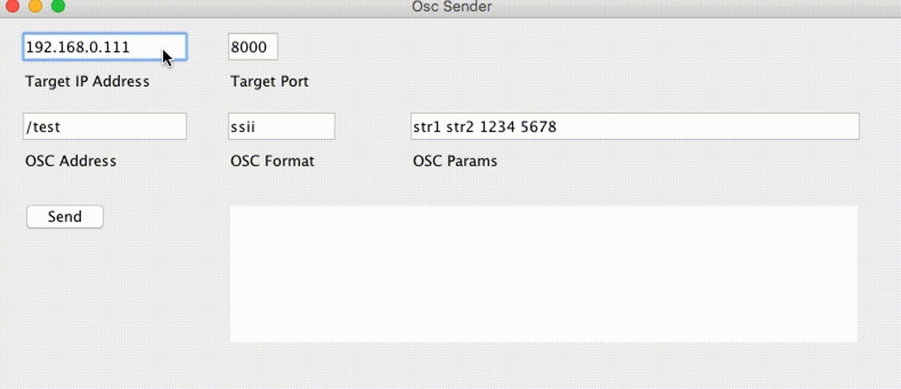

# OscSender

OscSender is simple debug tool for OSC.

### Usage

### Plugins

OscSender is currently extended with the following plugins. Instructions on how to use them in your own application are linked below.

| Plugin | README |
| ------ | ------ |
| ControlP5 | [https://github.com/sojamo/controlp5] |
| OscP5 | [https://github.com/sojamo/oscp5] |

### Todos

 - Write MORE Tests

License
----

MIT

